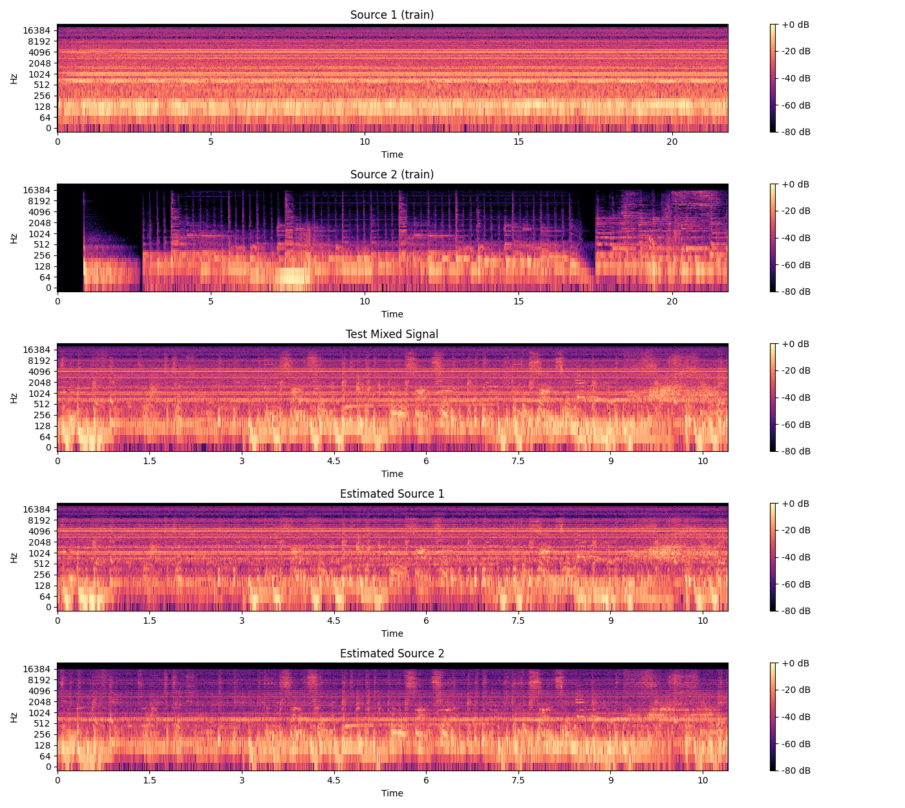

<h1>🎧 Source Separation with NMF</h1>

A simple and clean implementation of audio <strong>source separation</strong> using 
Non-negative Matrix Factorization (NMF). This project separates two sources from a mixed audio signal.

<h2>📁 Project Structure</h2>

<pre>
.
├── main.py                      # Main script
├── source_separation.py        # NMF dictionary & separation
├── arguments.py                # CLI arguments
├── data_loader.py              # Audio loading
├── utils.py                    # Utilities (SDR, spectrograms)
├── outputs/                    # Output results
└── data/
    ├── train/
    │   ├── source_1.wav
    │   └── source_2.wav
    └── test/
        └── test.wav
</pre>

<h2>🚀 How to Run</h2>

<pre><code>pip install numpy librosa soundfile scikit-learn matplotlib
</code></pre>

<pre><code>python main.py
</code></pre>

<h2>⚙️ Command Line Options</h2>

<table>
  <thead>
    <tr>
      <th>Argument</th>
      <th>Description</th>
      <th>Default</th>
    </tr>
  </thead>
  <tbody>
    <tr><td><code>--data_path</code></td><td>Path to dataset</td><td><code>./data</code></td></tr>
    <tr><td><code>--output_dir</code></td><td>Directory to save outputs</td><td><code>./outputs</code></td></tr>
    <tr><td><code>--sr</code></td><td>Sampling rate</td><td><code>48000</code></td></tr>
    <tr><td><code>--n_components</code></td><td>NMF components</td><td><code>64</code></td></tr>
    <tr><td><code>--n_fft</code></td><td>FFT window size</td><td><code>1024</code></td></tr>
    <tr><td><code>--hop_length</code></td><td>Hop size for STFT</td><td><code>512</code></td></tr>
    <tr><td><code>--eval_sdr</code></td><td>Print SDR before/after</td><td><i>flag</i></td></tr>
    <tr><td><code>--play_audio</code></td><td>Play result (IPython only)</td><td><i>flag</i></td></tr>
    <tr><td><code>--save_audio</code></td><td>Save separated audio</td><td><i>flag</i></td></tr>
    <tr><td><code>--plot_spectrogram</code></td><td>Save spectrogram image</td><td><i>flag</i></td></tr>
  </tbody>
</table>

<h2>📊 Example Output</h2>

The script will save audio and a spectrogram image:

<pre>
outputs/
├── estimated_source_1.wav
├── estimated_source_2.wav
└── spectrograms.png
</pre>

  

